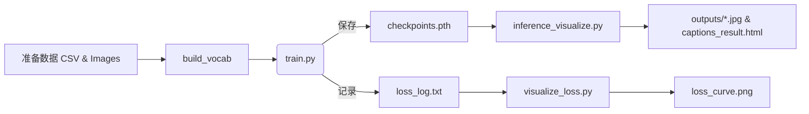
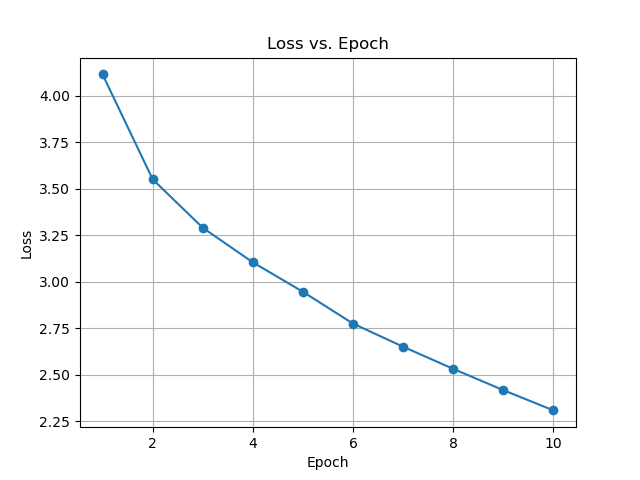

# 📸 RNN‑Based Image Captioning with PyTorch

[](./checkpoint.pth)
[](https://pytorch.org/)
[]()
[]()
[](./LICENSE)

> **CNN + RNN 图像字幕生成系统** — 使用预训练 ResNet‑50 提取视觉特征，LSTM 生成自然语言描述，支持训练、推理、Loss 曲线可视化以及批量结果导出。

---

## 📑 目录

1. [项目结构](#项目结构)
2. [环境与依赖](#环境与依赖)
3. [快速开始](#快速开始)
4. [模型架构图](#模型架构图)
5. [训练与推理流程](#训练与推理流程)
6. [可视化结果示例](#可视化结果示例)
7. [常见问题 FAQ](#常见问题faq)
8. [模型卡 (Model Card)](#模型卡-model-card)
9. [Roadmap](#roadmap)
10. [License](#license)

---

## 项目结构

```text
.
├── data/
│   ├── dataset.py          # Flickr8kDataset
│   └── vocab.py            # Vocabulary
├── models/
│   └── model.py            # EncoderCNN + DecoderRNN
├── utils.py                # save_checkpoint / load_checkpoint
├── train.py                # 训练入口
├── inference_visualize.py  # 推理 + 批量可视化 (HTML/JPG)
├── visualize_loss.py       # 绘制 Loss 曲线
├── config.yaml             # 参数配置
├── captions.csv            # image,caption 数据
├── checkpoints.pth         # 训练后权重
└── README.md
```

---

## 环境与依赖

```bash
conda create -n caption python=3.8 -y
conda activate caption
pip install -r requirements.txt
python - << 'PY'
import nltk; nltk.download('punkt')
PY
```

`requirements.txt` 核心：`torch torchvision nltk tqdm pyyaml matplotlib pillow`。

---

## 快速开始

```bash
# 1️⃣ 训练
python train.py            # 自动保存 checkpoint + loss_log.txt

# 2️⃣ 绘制 Loss 曲线
python visualize_loss.py   # 生成 loss_curve.png

# 3️⃣ 推理 & 可视化
python inference_visualize.py   # 结果到 ./outputs/
```

可修改 `config.yaml` 调节批量大小、学习率、epoch 等。

---

## 模型架构图

> *以下为逻辑示意，可在 notebooks 里渲染或在 README 引入 SVG/PNG。*

```
        ┌────────────┐        ┌───────────┐
 Image ─►  ResNet50  ├──2048─►  Linear   ├──256─┐
        └────────────┘        └───────────┘     │ (img features)
                                                 ▼
          ┌─────────────────────┐
          │  LSTM Decoder (512) │◄─ Embedding(256) ◄─ Token_t
          └─────────────────────┘
                        │
                        ▼
                  Softmax → Token_(t+1)
```

---

## 训练与推理流程



---

## loss曲线变化

| 原图                                      | 生成描述                                           |
|-----------------------------------------| ---------------------------------------------- |
|  | *A child in a pink dress climbing the stairs.* |

> 更多样例见 [`outputs/`](./outputs/) 目录和 `captions_result.html`。

---


## 模型卡 (Model Card)

| Field                      | Value                                |
| -------------------------- | ------------------------------------ |
| **Model**                  | ResNet‑50 encoder + LSTM‑512 decoder |
| **Dataset**                | Flickr8k (`image, caption` CSV)      |
| **Languages**              | English                              |
| **Intended Use**           | 教学 / 研究；不建议生产环境直接使用                  |
| **Limitations**            | 小规模数据，描述质量有限；难处理复杂场景                 |
| **Ethical Considerations** | 模型可能产生带偏见的描述；请勿用于敏感场景                |

---

## Roadmap

* [x] 基础 CNN + RNN 训练 / 推理
* [ ] 加入 Attention & Beam Search 生成
* [ ] Transformer Decoder 版本
* [ ] BLEU / CIDEr 自动评估脚本
* [ ] Streamlit Web Demo & HuggingFace Space

---

## License

MIT © 2025