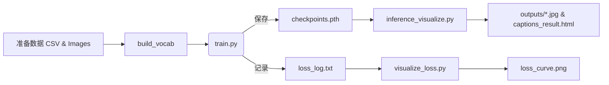

#  RNN‑Based Image Captioning with PyTorch

[](./checkpoints.pth)
[](https://pytorch.org/)
[]()
[]()
[](./LICENSE)

> **CNN + RNN 图像字幕生成** — 使用预训练 ResNet‑50 提取视觉特征，LSTM 生成自然语言描述，支持训练、推理、Loss 曲线可视化以及批量结果导出。

---

## 📑 目录

1. [项目结构](#项目结构)
2. [环境与依赖](#环境与依赖)
3. [模型架构图](#模型架构图)
4. [训练与推理流程](#训练与推理流程)
5. [loss曲线变化](#loss曲线变化)
6. [常见问题 FAQ](#常见问题faq)


---

## 项目结构

```text
.
├── archive/
│   ├── captions.csv        # image,caption 数据
│   └── images/
├── data/
│   ├── dataset.py          # Flickr8kDataset
│   └── vocab.py            # Vocabulary
├── models/
│   ├── encoder.py
│   ├── decoder.py
│   └── model.py            
├── utils.py                # save_checkpoint / load_checkpoint
├── train.py                # 训练入口
├── inference_visualize.py  # 推理 + 批量可视化 (HTML/JPG)
├── visualize_loss.py       # 绘制 Loss 曲线
├── config.yaml             # 参数配置
├── checkpoints.pth         # 训练后权重
└── README.md
```

---

## 环境与依赖

```bash
conda create -n caption python=3.8 -y
conda activate caption
pip install -r requirements.txt
python - << 'PY'
import nltk; nltk.download('punkt')
PY
```

`requirements.txt` 核心：`torch torchvision nltk tqdm pyyaml matplotlib pillow`。

---


## 模型架构图

> *以下为逻辑示意，可在 notebooks 里渲染或在 README 引入 SVG/PNG。*

```
        ┌────────────┐        ┌───────────┐
 Image ─►  ResNet50  ├──2048─►  Linear   ├──256─┐
        └────────────┘        └───────────┘     │ (img features)
                                                 ▼
          ┌─────────────────────┐
          │  LSTM Decoder (512) │◄─ Embedding(256) ◄─ Token_t
          └─────────────────────┘
                        │
                        ▼
                  Softmax → Token_(t+1)
```

---

## 训练与推理流程



---

## loss曲线变化
 

---

## 常见问题

| 问题                                             | 解决方法                                                                                                                                                                           |
|------------------------------------------------| ------------------------------------------------------------------------------------------------------------------------------------------------------------------------------ |
| **输出维度与目标维度不匹配(核心问题）**                         | 模型输出 `outputs` 和标签 `targets` 的裁剪处理，保持 `(batch × `(batch \xd7 seq\_len, vocab\_size)`与`(batch × `(batch \xd7 seq_len,)` 一致。 |
| **`init_hidden_state` 报错**                     | Decoder 类中无 `init_hidden_state`，推理时直接使用了 `LSTM()`，改为通过前馈方式初始化。                                                                                                                 |
| **RuntimeError: device-side assert triggered** | 由于标签中有词未被映射（如 `<unk>` 为 -1），或标签越界导致。确保 `vocab.numericalize()` 不会返回非法索引。                                                                                                        |

---
